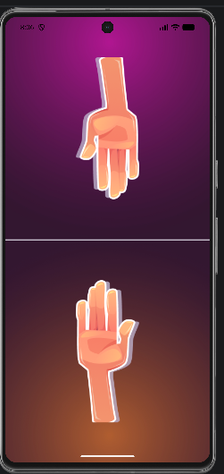

# ✊✋✌️ Rock Paper Scissors

This is another project from my **Flutter learning journey**.

I built this simple Rock Paper Scissors game to practice Flutter layouts, images, user interaction, and game logic using Dart.

The app lets the player choose **Rock**, **Paper**, or **Scissors**, then compares it with the computer's random choice to determine the winner.

---

## 📱 Screenshot



---

## ✨ Features

- 🤖 Random computer choice
- ✋ Rock, Paper, and Scissors selection
- 🏆 Win, Lose, or Draw result
- 🎨 Simple and clean UI
- 📱 Mobile-friendly design

---

## 🛠️ Built With

- Flutter
- Dart
- Material Design

---

## 📚 What I Learned

While building this project, I learned:

- Working with images and assets
- Handling button taps
- Using `setState()`
- Generating random values with Dart
- Creating reusable widgets
- Managing simple game logic
- Designing Flutter layouts

Every project teaches me something new, and this one helped me understand how user interaction works in Flutter.

---

## 📂 Project Structure

```text
lib/
├── screens/
├── widgets/
├── utils/
└── main.dart
```

---

## 🚀 Getting Started

Clone the repository

```bash
git clone https://github.com/your-username/rock-paper-scissors.git
```

Go to the project folder

```bash
cd rock-paper-scissors
```

Install dependencies

```bash
flutter pub get
```

Run the app

```bash
flutter run
```

---

## 🎯 Future Improvements

- 🧠 Score board
- 🎵 Sound effects
- ✨ Animations
- 👥 Two-player mode
- 🌙 Dark mode
- 📊 Match history

---

## 💭 About This Project

I'm currently learning Flutter and building small projects to improve my skills.

This Rock Paper Scissors game is part of that journey. Each project helps me become more comfortable with Flutter, Dart, and mobile app development.

There are many things I still want to learn, but I'm enjoying the process and improving with every project.

---

## ⭐ Support

If you like this project, please consider giving it a ⭐ on GitHub.

Feedback and suggestions are always welcome!
